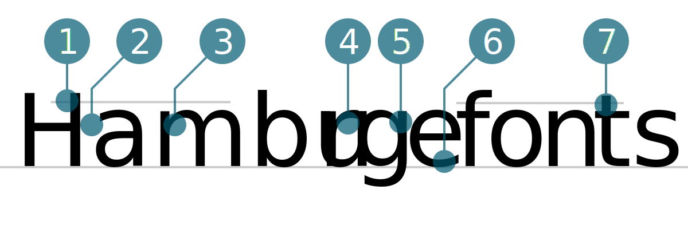

# Mukta Vaani
<small>Lars Mäder</small>

1. Oberkant Oberlänge überragt Versalhöhe
2. Doppelstöckiges (Zweistöckiges) a mit schrägem Anstrich
3. Verjüngung beim Anstrich bei den Buchstaben m, r und n
4. Schräger Abstrich beim Buchstabe r
5. Dreistöckiges g mit geradem Ohr (Fähnchen)
6. Schräger Abstrich beim e
7. Verkürzte Oberlänge beim Buchstabe t

## Design
{{Text}}

## Designer
{{Text}}

#### Quellen
1. [Name der Quelle](http://...)
2. [Name der Quelle](http://...)
