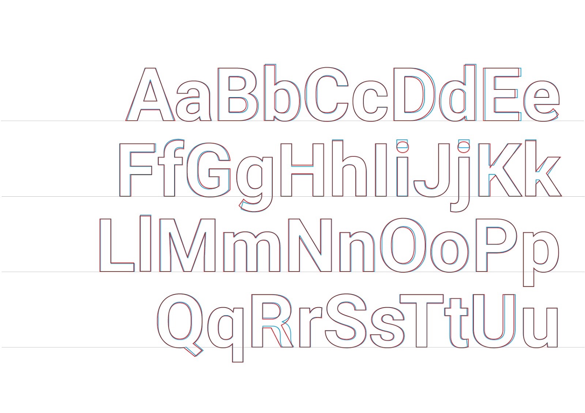

# Roboto
<small>Matthias Koch</small>

1. Oberkant Oberlänge überragt Versalhöhe
2. Doppelstöckiges (Zweistöckiges) a mit geradem Anstrich
3. Leichte Verjüngung
4. Gerader Abstrich beim r
5. Schräger Abstrich beim e
6. Gerader An und Abstrich

## Design
{{Text}}

## Designer
Die Roboto ist eine Serifenlose und Amerikanische Grotesk Schrift, 2011
entworfen von Christian Robertson.
Sie ist sie die Standart Schrift von Android (ab Android 4.0) und Google
Chrome, heute ist sie auch die Hausschrift für Google+, Google Play und
Google Maps.
Mit den 2014 erschienenen Material Design Guidelines von Google wurde
die Schrift stark überarbeitet fast alles hat sich verändert da die Schrift
auf allen Displays in Autos, Uhren, Desktops, Fernseher, Tablets und Mobile
funktionieren muss.
Alt und neu im Vergleich:

Um zwischen alt und neu zu unterscheiden sieht man sich am besten die
Buchstaben „R“ und „K“ an, sowie die Punkte auf dem „i“ und „j“ welche
nun rund sind.
Google betont dass die grössten Änderungen in dem Rhytmus und den
Abständen gemacht wurde, welches sich vorallem bei längerem Text bemerkbar
macht durch die bessere lesbarkeit.
„Ultimately the purpose of a typeface is to serve the content and help
people to understand it.“
-Louis Gray, Developer @ Google
Die Schrift wird auch weiterhin kontinuierlich überarbeitet und angepasst
da sich Displays, Interfaces und Systeme ebenfalls ständig verändern.
Zur Zeit ist die schrift in 12 Schnitten frei verfügbar, weitere sechs Schnitte
sind in Entwicklung.
Quellen:
https://github.com/google/roboto/
https://fonts.google.com/specimen/Roboto
https://material.io/guidelines/style/typography.html#
https://developers.googleblog.com/2014/07/the-new-roboto.html
https://de.wikipedia.org/wiki/Roboto
Roboto

#### Quellen
1. [Name der Quelle](http://...)
2. [Name der Quelle](http://...)
