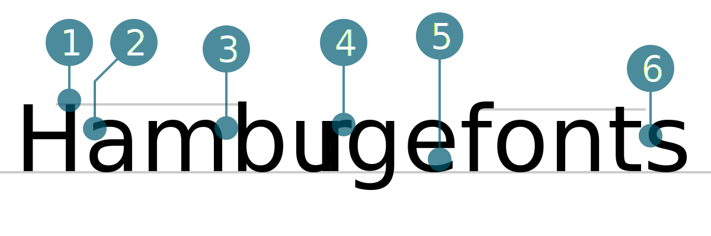

# Roboto
### {{Vorname}} {{Nachname}}

1. Oberkant Oberlänge überragt Versalhöhe
2. Doppelstöckiges (Zweistöckiges) a mit geradem Anstrich
3. Leichte Verjüngung
4. Gerader Abstrich beim r
5. Schräger Abstrich beim e
6. Gerader An und Abstrich
