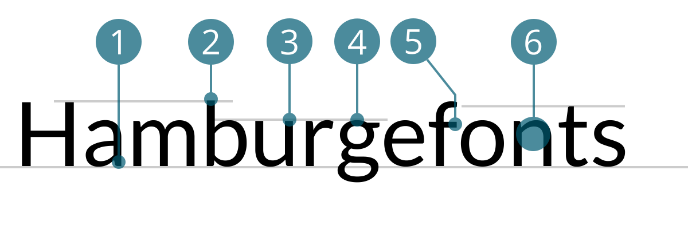

# Lato
<small>Pascale Anderegg</small>

1. Zweistöckiges a mit halb-rundem Abstrich, verjüngt
2. Oberkant Oberlänge überragt Versalhöhe nur minim
3. eher hohe x-Höhe
4. dreistöckiges g mit halb-runder Fahne, verjüngt
5. rechtwinkliger Abstrich bei f  
6. dünner werdender Überlauf (Verjüngung)  

## Design
Lato ist eine serifenlose und freie Schriftart von Łukasz Dziedzic und hat ihren Ursprung in Polen. Sie wurde im Sommer 2010 entwickelt und im Dezember 2010 unter der SIL Open Font License veröffentlicht. Die Schriftart hat ihren Namen von dem polnischen Wort Lato, welches für Sommer steht. Ursprünglich war die Lato für einen grösseren Kunden als Corporate Font-Set konzipiert worden. Dieser Kunde entschied sich aber am Ende für eine andere Stilrichtung und die Familie wurde für die Öffentlichkeit zugänglich. Bei der Entwicklung wurde Łukasz Dziedzic von Google unterstützt. Lato ist daher auch in der Google Font Bibliothek zu finden, wo sie zu den beliebtesten Schriftarten gehört.

Mit den 10 Schnitten wollte der Designer eine Schrift entwerfen, die für Body Text eine transparente Erscheinung aufweist. Ihre besonderen Merkmale sollen in grösseren Schriftgraden und beim genauerem Betrachten sichtbar werden. Er benutzte vor allem in den Oberlängen klassische Proportionen um der Schriftfamilie eine gewohnte Harmonie und Eleganz zu verleihen.

## Designer
Łukasz Dziedzic

#### Quellen
1. [Wikipedia](http://de.wikipedia.org/wiki/Lato)
2. [Lato](http://latofonts.com/)
3. [Google Font Bibliothek](http://fonts.google.com/specimen/Lato)
