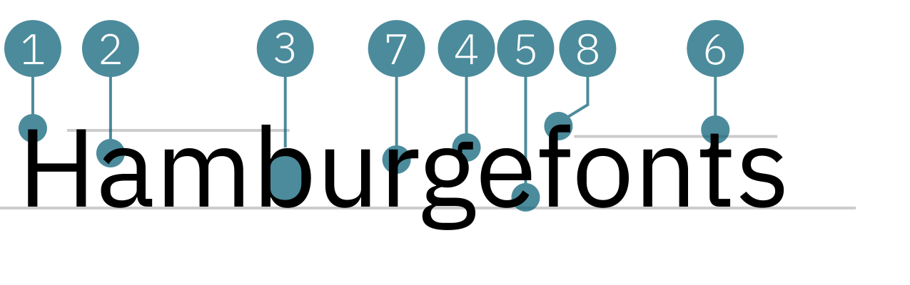

# IBM Plex Sans
<small>Stephanie Fuchs</small>

1. Versalhöhe H
2. Doppelstöckiges (Zweistöckiges) a mit schrägem Anstrich
3. Geschlossener Punzen
4. Dreistöckiges g mit geradem Ohr (Fähnchen)
5. Schräger Abstrich beim e
6. Verlängerte Oberlänge beim t,f,b
7. Haarlinie bei a,m,b,u,r,g,n
8. Ecke rund/eckig a,g,f,t

## Design
{{Text}}

## Designer
{{Text}}

#### Quellen
1. [Name der Quelle](http://...)
2. [Name der Quelle](http://...)
