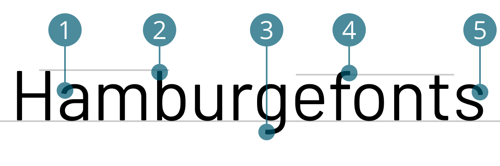

# Barlow
<small>Tieu Khe Mayer</small>

1. Ansatz schräg
2. Oberlänge Oberkant von b gleich wie Versalhöhe
3. sehr kurze Schleife
4. allgemein abgerundete Ecken
5. gerader Absatz

## Design
{{Text}}

## Designer
{{Text}}

#### Quellen
1. [Name der Quelle](http://...)
2. [Name der Quelle](http://...)
