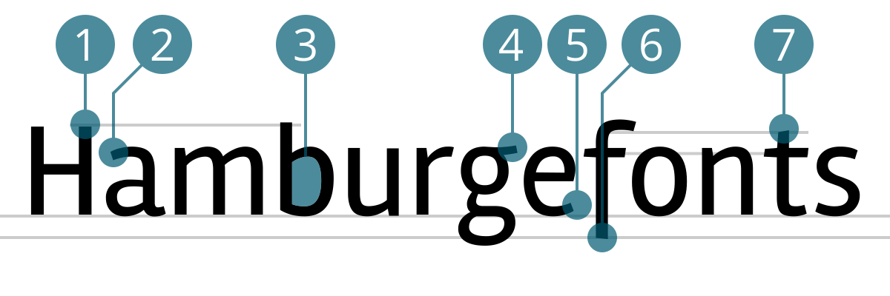

# Rambla
<small>Wolfgang Schoeck</small>

1. Oberkant Oberlänge überragt Versalhöhe
2. Doppelstöckiges (Zweistöckiges) a mit schrägem Anstrich
3. Geschlossener Punzen
4. Dreistöckiges g mit geradem Ohr (Fähnchen)
5. Schräger Abstrich beim e
6. Unterlänge beim f
7. Verkürzte, abgeschrägte Oberlänge beim t

## Design
{{Text}}

## Designer
{{Text}}

#### Quellen
1. [Name der Quelle](http://...)
2. [Name der Quelle](http://...)
